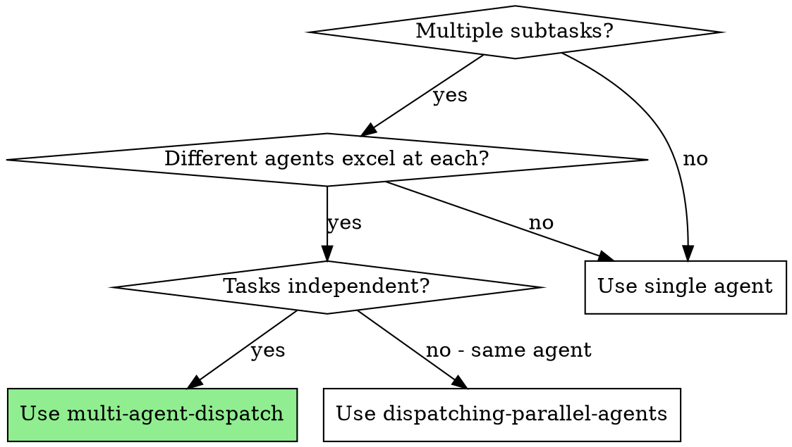
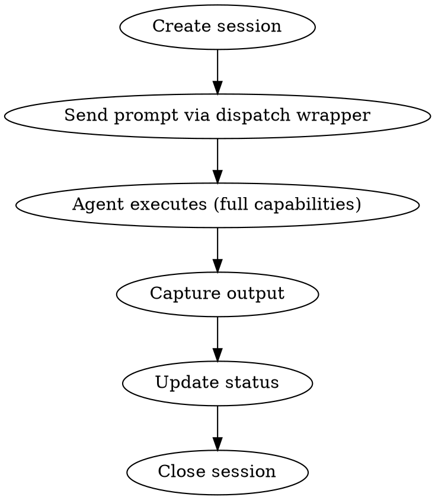

# Multi-Agent Dispatch

Orchestrate complex tasks across multiple specialized AI agents. Route tasks based on agent strengths, run them in parallel, and aggregate results.

**Core mechanism:** Uses ACP (Agent Client Protocol) via the local dispatch wrapper, which internally calls `acpx` with centralized approval, logging, and session management.

**Operational rule:** Do not invoke `acpx` directly from the outer agent. Always use `./scripts/dispatch.sh` (or sourced helper scripts) so approval mode, logging, routing, and guardrails stay consistent.

**Timeout rule:** Prefer passing `--timeout <seconds>` explicitly based on task size instead of relying on the default. Recommended starting points: `600` for read-only review, `1800` for normal implementation, `3600` for large tasks that may install dependencies or run long test/build loops.

## When to Use



**Use when:**
- You have independent subtasks that different agents excel at
- Frontend work -> Gemini, Code review -> Codex, Architecture -> Claude
- Need parallel execution across multiple specialists
- Want cross-model adversarial review (writer != reviewer)

**Don't use when:**
- All tasks are for the same agent (use dispatching-parallel-agents instead)
- Tasks have sequential dependencies that require shared state
- You don't have multiple agent CLIs installed

## Agent Strengths

| Agent | Best For | Invocation |
|-------|----------|------------|
| **Claude Code** | Architecture, security review, complex reasoning, long context | `@claude` |
| **Codex CLI** | Fast implementation, refactoring, focused execution | `@codex` |
| **Gemini CLI** | Frontend/UI, creative design, multimodal, large codebase | `@gemini` |
| **Claude Internal** | Same as Claude Code, via internal proxy | `@claude-internal` |
| **Codex Internal** | Same as Codex CLI, via internal proxy | `@codex-internal` |
| **Gemini Internal** | Same as Gemini CLI, via internal proxy | `@gemini-internal` |
| **Copilot** | Quick edits, code completion, refactoring | `@copilot` |
| **OpenCode** | General coding tasks | `@opencode` |

## Dispatch Modes

### Mode 1: Explicit Single Dispatch

Delegate one focused task to a specialist agent:

```bash
Dispatch task to Codex:
  ./scripts/dispatch.sh --approve-all --timeout 1800 single codex "Implement the authentication endpoint with JWT tokens"

Dispatch task to Claude:
  ./scripts/dispatch.sh --approve-reads --timeout 600 single claude "Review security implications of the new API"

Dispatch task to Gemini:
  ./scripts/dispatch.sh --approve-all --timeout 1800 single gemini "Design the user dashboard UI components"
```

Use `./agent-dispatch-prompt.md` template for structured dispatch.

### Mode 2: Parallel Batch Dispatch

Run multiple agents simultaneously on independent tasks:

```bash
# Simple format: "agent:task" pairs
./scripts/dispatch.sh --timeout 1800 batch \
  "codex:Implement REST API endpoints" \
  "claude:Security review of the API design" \
  "gemini:Design the onboarding UI"
```

Use `./scripts/task-coordinator.sh` for managed parallel execution with logging and error handling.

### Mode 3: Batch JSON (Programmatic Input)

Accept structured JSON tasks from other skills or external callers:

```bash
# JSON as argument
./scripts/dispatch.sh --timeout 1800 batch-json '[
  {"agent": "codex", "task": "Implement the auth module"},
  {"agent": "claude", "task": "Review security design"},
  {"agent": "gemini", "task": "Create login form UI"}
]'

# JSON from stdin (pipe from other skill)
echo '[{"agent":"codex","task":"impl"},{"agent":"claude","task":"review"}]' \
  | ./scripts/dispatch.sh batch-json -
```

This is the primary interface for **other skills to call dispatch** after they have decomposed tasks. The calling skill handles task planning; dispatch handles execution and result collection.

### Mode 4: Auto-Split Task Decomposition

AI decomposes a big task into subtasks and auto-assigns each to the best agent:

```bash
./scripts/dispatch.sh --timeout 1800 auto-split "Build a user registration system with email verification and rate limiting"
# AI decomposes into:
#   codex: Implement REST API endpoints with input validation
#   claude: Review authentication flow for security vulnerabilities
#   gemini: Create responsive registration form with accessibility
```

Uses Claude (configurable via `auto_split_agent` in config) to decompose. Output parsed as `agent:subtask` lines, then executed as parallel batch.

### Mode 5: Multi-Dimensional Code Review

Dispatch parallel code reviews from different perspectives, each assigned to the best-fit agent:

```bash
# Default dimensions: security, performance, architecture
./scripts/dispatch.sh --timeout 600 review src/auth/

# Specify dimensions
./scripts/dispatch.sh review src/api/users.ts security,performance,maintainability
```

**Built-in dimensions and default agent assignments:**

| Dimension | Default Agent | Focus |
|-----------|--------------|-------|
| security | claude | OWASP Top 10, injection, auth/authz, data exposure |
| performance | codex | Complexity, allocations, N+1 queries, caching |
| architecture | claude | SOLID, separation of concerns, testability |
| maintainability | codex | Naming, dead code, technical debt, clarity |
| accessibility | gemini | WCAG 2.1, color contrast, keyboard nav |

All reviews run in parallel with `--approve-reads` (read-only). Results are summarized per dimension after completion. Dimension-to-agent mapping and prompts are configurable via `review_dimensions` in config.

### Mode 6: Pattern-Based Routing

Configure routing rules in `~/.multi-agent-dispatch/config.json`:

```json
{
  "routes": [
    { "pattern": "src/ui/**/*.tsx", "agent": "gemini" },
    { "pattern": "src/api/**/*.ts", "agent": "codex" },
    { "pattern": "src/auth/**", "agent": "claude" },
    { "pattern": "**", "agent": "codex" }
  ]
}
```

Then route based on file path:
```bash
# Matches src/ui/** -> routes to gemini
./scripts/dispatch.sh --timeout 1800 route src/ui/Button.tsx "Add a loading state indicator"
```

## Session Management

Each dispatch creates a tracked session:

```
~/.multi-agent-dispatch/sessions/
├── dispatch-1711800000/
│   ├── metadata.json      # Agent, task, timestamps
│   ├── prompt.txt         # Original task prompt
│   ├── stdout.log         # Agent output
│   └── status.txt         # pending/running/completed/failed
└── ...
```

### Session Lifecycle



### Session Commands

```bash
# List sessions
ls ~/.multi-agent-dispatch/sessions/

# View output of specific session
cat ~/.multi-agent-dispatch/sessions/dispatch-*/stdout.log

# Check status
cat ~/.multi-agent-dispatch/sessions/dispatch-*/status.txt

# Clean old sessions (>7 days)
./scripts/session-manager.sh cleanup_old_sessions 7
```

## Result Aggregation

After parallel execution, results are printed per agent with status. Use `--json` flag for structured output:

```bash
# Text output (default)
./scripts/dispatch.sh --timeout 1800 batch "codex:Implement API" "claude:Review security"

# JSON output (for programmatic consumption by other skills)
./scripts/dispatch.sh --json --timeout 1800 batch "codex:Implement API" "claude:Review security"
```

**JSON output format:**
```json
{
  "total": 2,
  "completed": 2,
  "failed": 0,
  "duration_seconds": 120,
  "results": [
    {"agent": "codex", "session": "batch-1711800000-0", "status": "completed", "task": "Implement API", "output": "..."},
    {"agent": "claude", "session": "batch-1711800000-1", "status": "completed", "task": "Review security", "output": "..."}
  ]
}
```

**Review results** include per-dimension summary:
```bash
./scripts/dispatch.sh review src/auth/ security,performance
# Output:
#   === Code Review Summary: src/auth/ ===
#   --- [SECURITY] reviewed by claude ---
#   [findings...]
#   --- [PERFORMANCE] reviewed by codex ---
#   [findings...]
#   === End Review Summary ===
```

## Cross-Model Adversarial Review

A powerful pattern: the writer is always reviewed by a different model.

```bash
# Step 1: Codex implements
./scripts/dispatch.sh --approve-all --timeout 1800 single codex "Implement the feature as specified in docs/spec.md"

# Step 2: Claude reviews Codex's work
./scripts/dispatch.sh --approve-reads --timeout 600 single claude "Review the changes in the last commit for security and architecture quality"

# Step 3: Codex fixes based on review
./scripts/dispatch.sh --approve-all --timeout 1800 single codex "Fix issues identified in the security review: [paste Claude's findings]"
```

This catches blind spots that single-model development misses.

## Configuration

Config is auto-created on first run at `~/.multi-agent-dispatch/config.json`. All settings have sensible defaults — **no configuration required** for basic usage.

```json
{
  "version": "1.0",
  "agents": {
    "claude": { "capabilities": ["architecture", "review", "security"], "available": true },
    "codex": { "capabilities": ["implementation", "refactoring", "speed"], "available": true },
    "gemini": { "capabilities": ["frontend", "ui", "creativity"], "available": true },
    "codebuddy": { "capabilities": ["implementation", "refactoring", "acp"], "available": true },
    "claude-internal": { "capabilities": ["architecture", "review", "security"], "available": true },
    "codex-internal": { "capabilities": ["implementation", "refactoring", "speed"], "available": true },
    "gemini-internal": { "capabilities": ["frontend", "ui", "creativity"], "available": true }
  },
  "routes": [],
  "parallelism": 3,
  "timeout_seconds": 1800,
  "approval_mode": "approve-all",
  "auto_split_agent": "claude",
  "review_dimensions": {
    "security": { "agent": "claude", "prompt": "Review for security vulnerabilities..." },
    "performance": { "agent": "codex", "prompt": "Review for performance issues..." },
    "architecture": { "agent": "claude", "prompt": "Review for architectural issues..." },
    "maintainability": { "agent": "codex", "prompt": "Review for maintainability..." },
    "accessibility": { "agent": "gemini", "prompt": "Review for accessibility..." }
  }
}
```

`agents.*.available` is only an optional override to disable a known agent. Availability is otherwise determined by probing the installed ACP bridge/CLI at runtime.

### Project-level config override

You can also add a project-local config file named `.multi-agent-dispatch.json` at the repository root, or any parent directory above the current working directory.

Config lookup and precedence:

1. Load global config from `~/.multi-agent-dispatch/config.json`
2. Search upward from the current working directory for `.multi-agent-dispatch.json`
3. Merge the two configs, with **project-level values overriding global values**
4. Fall back to built-in defaults for any missing keys

This lets you keep safe global defaults, while customizing one repository's routing, approval mode, review mappings, or parallelism without affecting other projects.

Example project-level override:

```json
{
  "parallelism": 5,
  "approval_mode": "approve-reads",
  "routes": [
    { "pattern": "src/ui/*", "agent": "gemini" },
    { "pattern": "src/auth/*", "agent": "claude" }
  ],
  "review_dimensions": {
    "security": { "agent": "claude-internal", "prompt": "Review for security vulnerabilities and auth/session risks" }
  }
}
```

Environment-variable overrides:

- `PROJECT_CONFIG_FILE`: use an explicit project config path instead of auto-discovery
- `PROJECT_CONFIG_FILENAME`: change the auto-discovery filename from `.multi-agent-dispatch.json`

**Override review dimensions** to customize which agent handles each review angle, or change the review prompt per dimension.

## Safety & Control

- **Wrapper-only execution**: outer agents should call `./scripts/dispatch.sh`, not raw `acpx`
- **Approval Mode**: `./scripts/dispatch.sh --approve-all ...`, `--approve-reads ...`, `--deny-all ...`
- **Explicit Timeout**: prefer `./scripts/dispatch.sh --timeout 600 ...` for review, `--timeout 1800 ...` for standard implementation, `--timeout 3600 ...` for long-running builds/tests/install flows
- **Scope Limiting**: Use `--cwd` to restrict agent's working directory
- **Timeout**: Configurable per-task timeout (default 30 minutes)
- **Session Logging**: All interactions logged to `~/.multi-agent-dispatch/sessions/`

## Troubleshooting

**Agent CLI not found:**
```bash
which acpx       # Check acpx is installed
./scripts/dispatch.sh agents  # Probe discovered agents via the wrapper
```

**Session fails to start:**
- Ensure agent CLI is installed and authenticated
- Check `~/.multi-agent-dispatch/logs/acpx.log` for errors

**Parallel tasks conflict:**
- Ensure each agent edits different files
- Use `--cwd` to scope agents to subdirectories
- Consider using git worktrees for full isolation
